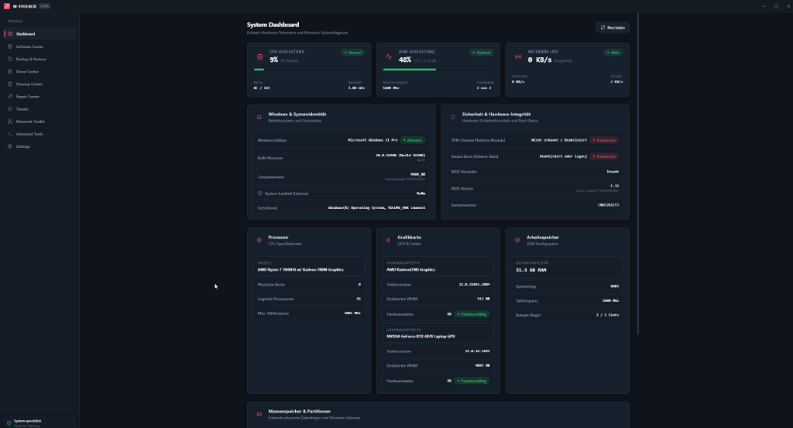
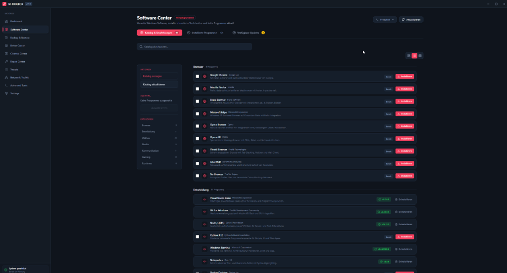
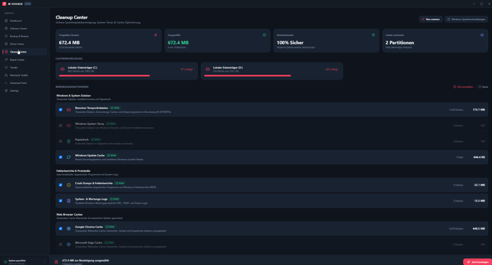
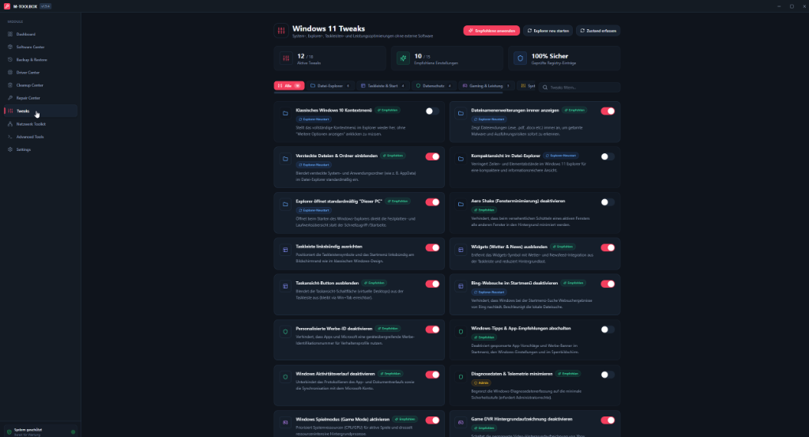

# M-Toolbox

> Moderne Windows-11-System-Utility-Suite für Wartung, Diagnose, Reparatur und Optimierung.

[](https://github.com/marka87/M-Toolbox/releases)
[](LICENSE)
[](https://www.microsoft.com/windows/windows-11)
[](https://www.electronjs.org/)
[](https://www.typescriptlang.org/)
[](https://react.dev/)

M-Toolbox bündelt native Windows-Werkzeuge, PowerShell, Winget und eine moderne Fluent-Oberfläche in einer Desktop-Anwendung. Die Suite arbeitet lokal und bietet verständliche, nachvollziehbare Aktionen für Administration und tägliche Pflege.

## Features

- **Dashboard** – CPU, RAM, GPU, Speicher, Betriebssystem und Live-Metriken.
- **Software Center** – Kuratierter Winget-Katalog, Suche, Kategorien, Batch-Installation und Updates.
- **Backup & Migration** – Vollständige Systemmigration & Reinstall-Archiv (`.mtoolbox`), Winget-Pakete, Registry, App-Daten, Browser-Profile und Wiederherstellungs-Assistent.
- **Driver Center** – Treiberinventar, Problemgeräte, Export, GPU-Informationen und Online-Suche.
- **RAM Guardian** – Echtzeit-RAM-Monitoring, Standby-List/Working-Set-Bereinigung, Hygiene-Score, 24h-Verlauf und RAM-Fresser-Inspektor.
- **Batterie-Manager & Energie-Profile** – Laptop-Akku-Management, 3 kuratierte Schnellprofile (🌱 Eco mit 80% CPU-Drossel auf Akku, ⚖️ Ausbalanciert, 🚀 Höchstleistung), Echtzeit-Watt-Überwachung (Entlade-/Laderate in W), Zellspannung, Kapazitäts- und Verschleißgradanalyse (Wh / mWh), Drain-Inspektor (Top Energie-Fresser), automatische Akku-Drain-Warnungen, interaktiver HTML-Akkubericht und Windows-Energieschemas.
- **Desktop Mini-HUD Widget** – Schwebendes, transparentes 2×2 Desktop-Overlay für CPU, RAM (inkl. 1-Klick-Bereinigung), GPU und Akku (inkl. Entlade-Wattage), Always-on-Top und Drag & Drop.
- **Cleanup Center & Bloatware-Entfernung** – Temporäre Dateien, Windows Update Cache Bereinigung mit UAC-Dienststeuerung, Browser-Caches, Crash Dumps und integrierte **Windows Bloatware-Erkennung & Deinstallation** mit Sicherheitsbewertung (Ampelsystem).
- **Repair Center** – SFC, DISM, Windows-Update-, Netzwerk-, Spooler- und AppX-Reparaturen.
- **Tweaks & 1-Klick Gaming-Modus** – Explorer-, Datenschutz-, Gaming- und Windows-11-Oberflächenanpassungen sowie **1-Klick Performance & Gaming Master-Modus** (deaktiviert Effekte, Transparenzen & Xbox DVR, pausiert Indexer, schaltet auf Höchstleistung).
- **Network Toolkit** – Adapterdiagnose, WAN-IP, Ping-Matrix, DNS-Benchmark und Port-Scanner.
- **Advanced Tools** – Windows-Tools, Autostart-Verwaltung und Hosts-Datei-Editor.
- **Settings** – Themes, Akzentfarben, Autostart, Updates, Cache und Systeminformationen.

## Screenshots

| Dashboard | Software Center |
| --- | --- |
|  |  |

| Cleanup Center | Tweaks |
| --- | --- |
|  |  |


## Installation

1. Lade die aktuelle Setup-Datei oder die portable Version aus den [GitHub Releases](https://github.com/marka87/M-Toolbox/releases).
2. Starte den Installer als normaler Windows-Benutzer.
3. Für einzelne Reparatur- und Systemaktionen fordert M-Toolbox bei Bedarf Administratorrechte an.

Voraussetzungen:

- Windows 11 x64
- Winget für das Software Center
- PowerShell 5.1 oder neuer

### 💡 Energie- und Laptop-Tipp (Nvidia Optimus / Hybrid-Grafik)

Auf Notebooks mit zwei Grafikkarten (integrierte Intel/AMD iGPU + dedizierte Nvidia dGPU) empfiehlt es sich, M-Toolbox der stromsparenden Grafikeinheit zuzuweisen, damit die dedizierte GPU im Leerlauf und Akkubetrieb im stromsparenden Ruhezustand (Zero-Power-State) verbleibt:
1. Öffne **Windows-Einstellungen → System → Anzeige → Grafik**.
2. Wähle **M-Toolbox** in der Liste (oder füge `M-Toolbox.exe` hinzu).
3. Klicke auf **Optionen** und wähle **„Energiesparen“** (integrierte GPU).

> Ergänzend: In den M-Toolbox-Einstellungen ist die Option *„GPU-Auslastung anzeigen“* standardmäßig deaktiviert, sodass weder `nvidia-smi` noch WMI-GPU-Zähler abgefragt werden und die dGPU ungestört schlafen kann.

## Entwicklung

```powershell
git clone https://github.com/marka87/M-Toolbox.git
cd M-Toolbox
npm ci
npm run dev
```

Weitere Regeln und bekannte Windows-Entwicklungsdetails stehen in [`AGENT_GUIDE.md`](AGENT_GUIDE.md).

## Build

```powershell
npm run typecheck
npm run build:renderer
npm run build:setup
npm run build:portable
```

Die fertigen Dateien werden in `release/` abgelegt. Alternativ stehen [`release.cmd`](release.cmd) und [`release.ps1`](release.ps1) zur Verfügung.

## Projektstruktur

```text
src/
├── main/                 # Electron Main Process und native Services
├── preload/              # Sichere Context-Bridge
├── renderer/             # React-Oberfläche
└── shared/               # IPC-Kanäle und gemeinsame Typen
.github/                 # Workflows, Templates und Dependabot
docs/                    # Screenshots, Assets und Projekt-Dokumentation
```

## Roadmap

Der aktuelle Stand und geplante Arbeiten stehen in [`ROADMAP.md`](ROADMAP.md).

## Changelog

Release-Historie nach Keep-a-Changelog: [`CHANGELOG.md`](CHANGELOG.md).

## Lizenz

M-Toolbox ist unter der [MIT-Lizenz](LICENSE) veröffentlicht.

## Credits

- **Mark Angyal** – Projekt und Maintainer
- Electron, React, TypeScript, Vite, Tailwind CSS, SQLite, Winget und Windows-Systemwerkzeuge

## Support

Für Fehler, Vorschläge und Fragen siehe [`SUPPORT.md`](SUPPORT.md). Sicherheitsprobleme bitte ausschließlich gemäß [`SECURITY.md`](SECURITY.md) melden.
